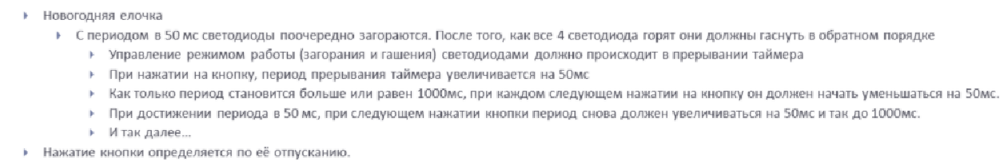

==    Домашняя работа

Создан и настроен проект в IAR Workbench.

Задание:

Код данной программы делится на три части:

1.Запуск функции __low_level_init(),_ здесь происходит настройка программы и установка;

2.Код прерывания таймера _TIM5,_ который отвечает за включение светодиодов;

3._int main,_ в котором описывается работа с кнопкой.

Код программы представлен ниже:

----

#include "gpiocregisters.hpp"
#include "gpioaregisters.hpp"
#include "rccregisters.hpp"
#include "tim5registers.hpp"
#include "nvicregisters.hpp"
using namespace std ;
extern "C"
{
  int __low_level_init(void)
  {
    RCC::AHB1ENR::GPIOCEN::Enable::Set();
    RCC::AHB1ENR::GPIOAEN::Enable::Set();
    GPIOC::MODER::MODER13::Input::Set();
    GPIOC::MODER::MODER9::Output::Set();
    GPIOC::MODER::MODER8::Output::Set();
    GPIOC::MODER::MODER5::Output::Set();
    GPIOA::MODER::MODER5::Output::Set();
    RCC::APB1ENR::TIM5EN::Enable::Set();
    GPIOC::MODER::MODER13::Input::Set();
    TIM5::PSC::Write(15999U);
    TIM5::ARR::Write(1000U);
    TIM5::CNT::Write(0U);
    NVIC::ISER1::Write(1U << 18U);
    TIM5::DIER::UIE::Enable::Set();
    return 1;
}}
unsigned int flag = 0;
void LedOn(uint8_t Index)
{
  if (flag == 0)
  {
  switch (Index)
    {
      case 0:
      GPIOC::BSRR::BS5::High::Write();
      break;
      case 1:
      GPIOC::BSRR::BS8::High::Write();
      break;
      case 2:
      GPIOC::BSRR::BS9::High::Write();
      break;
      case 3:
      GPIOA::BSRR::BS5::High::Write();
      break;
    }
  }
  if (flag == 1)
  {
      switch (Index)
    { case 0:
      GPIOA::BSRR::BR5::Low::Write();
      break;
      case 1:
      GPIOC::BSRR::BR9::Low::Write();
      break;
      case 2:
      GPIOC::BSRR::BR8::Low::Write();
      break;
      case 3:
      GPIOC::BSRR::BR5::Low::Write();
      break;
    }
  }
}
uint8_t Index = 0U;

void MyTim5InterruptHandler()
{
  if (TIM5::SR::UIF::UpdatePending::IsSet() && (TIM5::DIER::UIE::Enable::IsSet()))
  { TIM5::SR::UIF::NoUpdate::Set();
    LedOn(Index);
    Index++;
    if (Index == 4)
    {
      Index = 0;
        if (flag == 0)
        {flag = 1;}
        else
        {flag = 0;
}}}}
int main()
{
  uint16_t Leds = 1000U;
  TIM5::CR1::CEN::Enable::Set();
  for(;;)
  {
    if(GPIOC::IDR::IDR13::Low::IsSet())
    { TIM5::ARR::Write(Leds);
      TIM5::CNT::Write(0U);
      Leds = Leds - 50U;
      if (Leds == 50U)
      {Leds = 1000U;}}
}
  return 0 ;
}

----